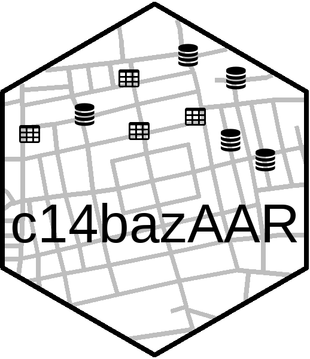

<p align="center">
  
</p>

[](https://www.repostatus.org/#active)
[](https://github.com/ropensci/c14bazAAR/actions/workflows/check-release.yaml)
[](https://codecov.io/github/ropensci/c14bazAAR?branch=master)
[](https://www.r-project.org/Licenses/GPL-2)
[](https://doi.org/10.17605/OSF.IO/3DS6A)
[](https://doi.org/10.21105/joss.01914)

c14bazAAR is an R package to query different openly accessible radiocarbon date databases. It allows basic data cleaning, calibration and merging. If you're not familiar with R other tools (such as [GoGet](https://www.ibercrono.org/goget/index.php)) to search for radiocarbon dates might be better suited for your needs.

- [**Installation**](#installation)
- [**How to use**](#how-to-use) ([Download](#download), [Calibration](#calibration), [Material classification](#material-classification), [Country attribution](#country-attribution), [Duplicates](#duplicates), [Conversion](#conversion), [Technical functions](#technical-functions), [Plotting and visualization](#plotting-radiocarbon-data), [Interaction with other radiocarbon data packages](#other-radiocarbon-packages))
- [**Databases**](#databases)
- [**Contributing**](#contributing) ([Adding database getter functions](#adding-database-getter-functions), [Pre-submision testing](#pre-submision-testing), [Versioning](#versioning))
- [**Citation**](#citation)
- [**License**](#license)

If you want to use data downloaded with c14bazAAR for your research, you have to cite the respective source databases. Most databases have a preferred way of citation that also may change over time with new versions and publications. Please check the [relevant homepages](#databases) to find out more. The output of c14bazAAR does not contain the full citations of the individual dates, but only a short reference tag. For further information you have to consult the source databases.

### Installation

We recommend to install the stable version from the [R-universe](https://r-universe.dev/) repository of [rOpenSci](https://ropensci.org/) with the following command (in your R console):

```
install.packages("c14bazAAR", repos = c(ropensci = "https://ropensci.r-universe.dev"))
```

The development version can be installed from github with the following command (in your R console):

```
if(!require('remotes')) install.packages('remotes')
remotes::install_github("ropensci/c14bazAAR")
```

Both versions are up-to-date and include all databases and features. Installing the development version on Windows requires the toolchain bundle [Rtools](https://cran.r-project.org/bin/windows/Rtools/).

The package needs a lot of other packages -- many of them only necessary for specific tasks. Functions that require certain packages you don't have installed yet will stop and ask you to enable them. Please do so with [`install.packages()`](https://www.r-bloggers.com/installing-r-packages/) to download and install the respective packages from CRAN.

### How to use

The package contains a set of getter functions (see below) to query the databases. Thereby not every available variable from every archive is downloaded. Instead c14bazAAR focuses on a [selection](https://github.com/ropensci/c14bazAAR/blob/master/data-raw/variable_definition.csv) of the most important and most common variables to achieve a certain degree of standardization. The downloaded dates are stored in the custom S3 class `c14_date_list` which acts as a wrapper around the [tibble](https://tibble.tidyverse.org/) class and provides specific class methods.

A workflow to download and prepare all dates could look like this:

```
library(c14bazAAR)
library(magrittr)

get_c14data("all") %>%
  remove_duplicates() %>%
  calibrate() %>%
  classify_material() %>%
  determine_country_by_coordinate()
```

It takes quite some time to run all of this and it's probably not necessary for your use case. Here's a list of the main tasks c14bazAAR can handle. That allows you to pick what you need:

#### Download

c14bazAAR contains a growing selection of getter functions to download radiocarbon date databases. [Here's](#databases) a list of all available databases. You can download all dates at once with [`get_c14data("all")`](https://github.com/ropensci/c14bazAAR/blob/master/R/get_c14data.R). The getters download the data, adjust the variable selection according to a defined [variable key](https://github.com/ropensci/c14bazAAR/blob/master/data-raw/variable_reference.csv) and transform the resulting list into a `c14_date_list`. 

See `?get_c14data` for more information.

```
x <- get_c14data("all")
```

#### Calibration

The [`calibrate()`](https://github.com/ropensci/c14bazAAR/blob/master/R/c14_date_list_calibrate.R) function calibrates all valid dates in a `c14_date_list` individually with [`Bchron::BchronCalibrate()`](https://github.com/andrewcparnell/Bchron/blob/master/R/BchronCalibrate.R). It provides two different types of output: calprobdistr and calrange.

See `?calibrate` for more information.

```
x %>% calibrate()
```

#### Material classification

Most 14C databases provide some information about the material sampled for the individual date. Unfortunately this information is often very specific and makes filtering operations difficult for large datasets. The function [`classify_material()`](https://github.com/ropensci/c14bazAAR/blob/master/R/c14_date_list_classify_material.R) relies on a [custom made classification](https://github.com/ropensci/c14bazAAR/blob/master/data-raw/material_thesaurus.csv) to simplify this data.

See `?classify_material` for more information and look [here](https://github.com/ropensci/c14bazAAR/blob/master/data-raw/material_thesaurus_comments.md) for a change log of the thesaurus.

```
x %>% classify_material()
```

#### Country attribution

Filtering 14C dates by country is useful for a first spatial limitation and especially important, if no coordinates are documented. Most databases provide the variable country, but they don't rely on a unified naming convention and therefore use various terms to represent the same entity. The function [`fix_database_country_name()`](https://github.com/ropensci/c14bazAAR/blob/master/R/c14_date_list_spatial_fix_database_country_name.R) tries to unify the semantically equal terms by string comparison with the curated country name list [`countrycode::codelist`](https://github.com/vincentarelbundock/countrycode) and a [custom made thesaurus](https://github.com/ropensci/c14bazAAR/blob/master/data-raw/country_thesaurus.csv). Beyond that it turned out to be much more reliable to look at the coordinates to determine the country.

That's what the function [`determine_country_by_coordinate()`](https://github.com/ropensci/c14bazAAR/blob/master/R/c14_date_list_spatial_determine_country_by_coordinate.R) does. It joins the position with country polygons from [`rworldxtra::countriesHigh`](https://github.com/AndySouth/rworldxtra) to get reliable country attribution.

See `?country_attribution` for more information.

```
x %>%
  fix_database_country_name() %>%
  determine_country_by_coordinate()
```

#### Duplicates

Some of the source databases already contain duplicated dates and for sure you'll have some if you combine different databases. As a result of the long history of these archives, which includes even mutual absorption, duplicates make up a significant proportion of combined datasets. It's not trivial to find and deal with theses duplicates, because they are not exactly identical between databases: Sometimes they are linked to conflicting and mutually exclusive context information.

For an automatic search and removal based on identical lab numbers we wrote [`remove_duplicates()`](https://github.com/ropensci/c14bazAAR/blob/master/R/c14_date_list_duplicates_remove.R). This functions offers several options on how exactly duplicates should be treated.

If you call `remove_duplicates()` with the option `mark_only = TRUE` then no data is removed, but you can inspect the duplicate groups identified.

See `?duplicates` for more information.

```
x %>%
  remove_duplicates()
```

#### Conversion

A c14_date_list can be directly converted to other R data structures. So far only [`as.sf()`](https://github.com/ropensci/c14bazAAR/blob/master/R/c14_date_list_convert.R) is implemented. The sf package provides great tools to manipulate and plot spatial vector data. This simplifies certain spatial operations with the date point cloud.

See `?as.sf` for more information.

```
x %>% as.sf()
```

#### Technical functions

c14_date_lists are constructed with [`as.c14_date_list`](https://github.com/ropensci/c14bazAAR/blob/master/R/c14_date_list_basic.R). This function takes data.frames or tibbles and adds the c14_date_list class tag. It also calls [`order_variables()`](https://github.com/ropensci/c14bazAAR/blob/master/R/c14_date_list_order_variables.R) to establish a certain variable order and [`enforce_types()`](https://github.com/ropensci/c14bazAAR/blob/master/R/c14_date_list_enforce_types.R) which converts all variables to the correct data type. There are custom `print()`, `format()` and `plot()` methods for c14_date_lists.

The [`fuse()`](https://github.com/ropensci/c14bazAAR/blob/master/R/c14_date_list_fuse.R) function allows to rowbind multiple c14_date_lists.

See `?as.c14_date_list` and `?fuse`.

```
x1 <- data.frame(
  c14age = 2000,
  c14std = 30
) %>% as.c14_date_list()

x2 <- fuse(x1, x1)
```

#### Plotting radiocarbon data

c14bazAAR only provides a very basic `plot` function for `c14_date_list`s. The [simple plotting vignette](https://github.com/ropensci/c14bazAAR/blob/master/vignettes/simple_plotting.Rmd) introduces some techniques to help you get started with more sophisticated visualization.

#### Other radiocarbon packages

There are several R packages that provide functions to calibrate, analyze or model radiocarbon dates: e.g. [oxcAAR](https://github.com/ISAAKiel/oxcAAR), [rcarbon](https://github.com/ahb108/rcarbon), [Bchron](https://github.com/andrewcparnell/Bchron)

They usually have a simple, vector based interface and you can use `c14_date_list` columns as input.

```
rcarbon::calibrate(x = x$c14age, error = x$c14std)
```

### Databases

To suggest other archives to be queried you can join the discussion [here](https://github.com/ropensci/c14bazAAR/issues/2).

* [`get_c14data("14cpalaeolithic")`](R/get_14cpalaeolithic.R) [**14cpalaeolithic**](https://ees.kuleuven.be/geography/projects/14c-palaeolithic/radiocarbon-palaeolithic-europe-database-v26-extract.xlsx): Radiocarbon Palaolithic Europe Database V26, June 2019 by [Pierre M. Vermeersch](https://ees.kuleuven.be/geography/projects/14c-palaeolithic/) (2019).
* [`get_c14data("14sea")`](R/get_14sea.R) [**14sea**](http://www.14sea.org/) 14C database for Southeast Europe and Anatolia (10,000–3000 calBC).
* [`get_c14data("adrac")`](R/get_adrac.R) [**adrac**](https://github.com/dirkseidensticker/aDRAC): Archives des datations radiocarbone d'Afrique centrale by Dirk Seidensticker.
* [`get_c14data("agrichange")`](R/get_agrichange.R) [**agrichange**](https://zenodo.org/record/4541470): Radiocarbon dates associated to Neolithic contexts (ca. 5900 – 2000 cal BC) from the northwestern Mediterranean Arch to the High Rhine area by [Héctor Martínez-Grau, Berta Morell-Rovira & Ferran Antolín](https://openarchaeologydata.metajnl.com/articles/10.5334/joad.72/) (2021).
* [`get_c14data("austarch")`](R/get_austarch.R) [**austarch**](https://archaeologydataservice.ac.uk/archives/view/austarch_na_2014/): A Database of 14C and Luminescence Ages from Archaeological Sites in Australia by [Alan N. Williams, Sean Ulm, Mike Smith, Jill Reid](https://intarch.ac.uk/journal/issue36/6/williams.html).
* [`get_c14data("bda")`](R/get_bda.R) [**BDA**](https://nakala.fr/10.34847/nkl.dde9fnm8): Base de Données Archéologiques by **Thomas Perrin** (1994).
* [`get_c14data("calpal")`](R/get_calpal.R) [**calpal**](https://uni-koeln.academia.edu/BernhardWeninger/CalPal): Radiocarbon Database of the CalPal software package by Bernhard Weninger. See [nevrome/CalPal-Database](https://github.com/nevrome/CalPal-Database) for an interface.
* [`get_c14data("caribbean")`](R/get_caribbean.R) [**caribbean**](https://github.com/philriris/caribbean-14C/): A compilation of 2147 anthropogenic radiocarbon (14C) dates for the Caribbean region from 504 sites across 57 islands by **Phil Riris** (2021).
* [`get_c14data("context")`](R/get_context.R) [**context**](http://context-database.uni-koeln.de/): Collection of radiocarbon dates from sites in the Near East and neighboring regions (20.000 - 5.000 calBC) by Utz Böhner and Daniel Schyle.
* [`get_c14data("eubar")`](R/get_eubar.R) [**eubar**](https://telearchaeology.org/eubar-c14-database/): A database of 14C measurements for the European Bronze Age by [Gacomo Capuzzo](https://telearchaeology.org/EUBAR/).
* [`get_c14data("euroevol")`](R/get_euroevol.R) [**euroevol**](https://discovery.ucl.ac.uk/1469811/): Cultural Evolution of Neolithic Europe Dataset by [Katie Manning, Sue Colledge, Enrico Crema, Stephen Shennan and Adrian Timpson](https://openarchaeologydata.metajnl.com/articles/10.5334/joad.40/).
* [`get_c14data("irdd")`](R/get_irdd.R) [**irdd**](https://sites.google.com/site/chapplearchaeology/irish-radiocarbon-dendrochronological-dates): [Robert M Chapple](https://doi.org/10.5281/zenodo.3367518)'s Catalogue of Radiocarbon Determinations & Dendrochronology Dates is a free-to-download resource for Irish archaeology.
* [`get_c14data("jomon")`](R/get_jomon.R) [**jomon**](https://github.com/ercrema/jomonPhasesAndPopulation): A multi-proxy inference of Jōmon population dynamics using bayesian phase models, residential data, and summed probability distribution of 14C dates [Enrico R. Crema and Ken'ichi Kobayashi](https://www.sciencedirect.com/science/article/pii/S0305440320300583) (2020).
* [`get_c14data("katsianis")`](R/get_katsianis.R) [**katsianis**](https://rdr.ucl.ac.uk/articles/Dataset_for_An_Aegean_history_and_archaeology_written_through_radiocarbon_dates/12489137/1): An Aegean History and Archaeology Written through Radiocarbon Dates [Markos Katsianis, Andrew Bevan, Giorgos Styliaras & Yannis Maniatis](https://openarchaeologydata.metajnl.com/articles/10.5334/joad.65/) (2020).
* [`get_c14data("kiteeastafrica")`](R/get_kiteeastafrica.R) [**kiteeastafrica**](https://dataverse.harvard.edu/dataset.xhtml?persistentId=doi:10.7910/DVN/NJLNRJ): Radiocarbon dates from eastern Africa in the CARD2.0 format by [Colin Courtney Mustaphi, Rob Marchant](https://www.openquaternary.com/articles/10.5334/oq.22/).
* [`get_c14data("medafricarbon")`](R/get_medafricarbon.R) [**MedAfriCarbon**](https://zenodo.org/record/3689716#.XnSHp4hKiUk): The MedAfriCarbon Radiocarbon Database and [Web Application](https://theia.arch.cam.ac.uk/MedAfriCarbon/). Archaeological Dynamics in Mediterranean Africa, ca. 9600–700 BC by [Giulio Lucarini, Toby Wilkinson, Enrico R. Crema, Augusto Palombini, Andrew Bevan and Cyprian Broodbank](https://openarchaeologydata.metajnl.com/articles/10.5334/joad.60/) (2020).
* [`get_c14data("nerd")`](R/get_nerd.R) [**NERD**](https://github.com/apalmisano82/NERD): Near East Radiocarbon Dates **Alessio Palmisano, Andrew Bevan, Dan Lawrence & Stephen Shennan** (2021).
* [`get_c14data("pacea")`](R/get_pacea.R) [**pacea**](http://www.paleoanthro.org/media/journal/content/PA20110001_S01.zip): PACEA Geo-Referenced Radiocarbon Database for the late Middle Paleolithic, Upper Paleolithic, and initial Holocene in Europe by [Francesco D'Errico, William E. Banks, Marian Vanhaeren, Véronique Laroulandie and Mathieu Langlais](http://www.paleoanthro.org/media/journal/content/PA20110001.pdf) (2011). 
* [`get_c14data("palmisano")`](R/get_palmisano.R) [**palmisano**](https://dx.doi.org/10.14324/000.ds.1575442): Regional Demographic Trends and Settlement Patterns in Central Italy: Archaeological Sites and Radiocarbon Dates by [Alessio Palmisano, Andrew Bevan and Stephen Shennan](https://openarchaeologydata.metajnl.com/articles/10.5334/joad.43/) (2018).
* [`get_c14data("radon")`](R/get_radon.R) [**radon**](https://radon.ufg.uni-kiel.de/): Central European and Scandinavian database of 14C dates for the Neolithic and Early Bronze Age by [Dirk Raetzel-Fabian, Martin Furholt, Martin Hinz, Johannes Müller, Christoph Rinne, Karl-Göran Sjögren und Hans-Peter Wotzka](https://www.jna.uni-kiel.de/index.php/jna/article/view/65).
* [`get_c14data("radonb")`](R/get_radonb.R) [**radonb**](https://radon-b.ufg.uni-kiel.de/): Database for European 14C dates for the Bronze and Early Iron Age by Jutta Kneisel, Martin Hinz, Christoph Rinne.
* [`get_c14data("rxpand")`](R/get_rxpand.R) [**rxpand**](https://github.com/jgregoriods/rxpand): Radiocarbon dates for the spread of farming and ceramics in tropical South America by **Jonas Gregorio de Souza**.

### Contributing

If you would like to contribute to this project, please start by reading our [Guide to Contributing](https://github.com/ropensci/c14bazAAR/blob/master/CONTRIBUTING.md). Please note that this project is released with a Contributor [Code of Conduct](https://github.com/ropensci/c14bazAAR/blob/master/CONDUCT.md). By participating in this project you agree to abide by its terms.

#### Adding database getter functions

If you want to add another radiocarbon database to c14bazAAR (maybe from the list [here](https://github.com/ropensci/c14bazAAR/issues/2)) you can follow this checklist to apply all the necessary changes to the package:

1. Add your database to the [variable_reference table](https://github.com/ropensci/c14bazAAR/blob/master/data-raw/variable_reference.csv) and map the database variables to the variables of c14bazAAR and other databases. Please also add additional variables, which are not used in c14bazAAR but available in this database, below.
2. Write the getter function `get_[The Database Name]` in an own script file: **get_[the database name].R**. For the script file names we used a lowercase version of the database name. The function name on the other hand can contain upper case letters. The getter functions have a standardized layout and always yield an object of the class `c14_date_list`. Please look at some of the available functions to get an idea how it is supposed to look like and which checks it has to include. Make sure not to store data outside of `tempdir()`. Some databases include non-radiocarbon dates: Make sure to filter them out -- c14bazAAR so far only works with radiocarbon dates.
3. Add the following roxygen2 tags above the function definition to include it in the package documentation.

```
#' @rdname db_getter_backend
#' @export
```

4. Update the package documentation with roxygen2.
5. Add the database url(s) to the [url_reference table](https://github.com/ropensci/c14bazAAR/blob/master/data-raw/db_info_table.csv) to make `get_db_url("[the database name]")` work.
6. Update the [material_thesaurus table](https://github.com/ropensci/c14bazAAR/blob/master/data-raw/material_thesaurus.csv) with all the new material names in your new database (for `classify_material()`). Document the changes [here](https://github.com/ropensci/c14bazAAR/blob/master/data-raw/material_thesaurus_comments.md).
7. Do the same for the [country thesaurus table](https://github.com/ropensci/c14bazAAR/blob/master/data-raw/country_thesaurus.csv) if necessary (for `fix_database_country_name()`).
8. Run the data-raw/data_prep.R script to update the data objects in the package. Only this enables the changes made in the steps 5, 6 and 7. You should test your changes now by running the respective lookup functions.
9. Add the getter function your wrote in 2 to the functions vector in [`get_all_parser_functions()`](https://github.com/ropensci/c14bazAAR/blob/master/R/get_c14data.R#L128).
10. Document the addition of the new function in the NEWS.md file.
11. Add the new database to the list of *Currently available databases* in the DESCRIPTION file.
12. Add your function to the database list in the README file [here](https://github.com/ropensci/c14bazAAR#databases).

#### Pre-submision testing

Before submitting patches or new getter functions via a pull request, we ask you to check the following items:

1. The package works and all functions are usable
2. The package documentation is up-to-date and represents the functions correctly
3. The test coverage of the package functions is sufficient
4. `DESCRIPTION` is up-to-date with the latest version number and database list
5. `README.md` is up-to-date
6. `NEWS.md` is up-to-date and includes the latest changes
7. **Package checks ran and did not yield any ERRORS, WARNINGS or NOTES (or at least the NOTES are addressed in the cran-comments.md)**
	- **locally (`devtools::check()`)**
	- rhub (`devtools::check_rhub(email = ...)`)
	- winbuilder (`devtools::check_win_release(email = ....)` + `devtools::check_win_devel(email = ....)`)
8. Spellcheck with `devtools::spell_check()` ran and did yield not only false-positives
9. codemeta.json is up-to-date (can be updated with `codemetar::write_codemeta()`)
10. `inst/CITATION` is up-to-date
11. The package does not make external changes without explicit user permission. It does not write to the file system, change options, install packages, quit R, send information over the internet, open external software, etc.
12. No reverse dependencies break because of the new package version (`devtools::revdep_check()`)

Please make sure to run the tests listed above and pay special attention to the highlighted items.

#### Versioning

Version numbers (releases) follow the [semantic versioning schema](https://semver.org/) and consist of mayor and minor releases as well as patches.

* **x**.y.z: a **mayor** release will be made once an existing function is radically changed or removed and thus the package API is changed.
* x.**y**.z: a **minor** release contains new parsers and auxiliary functions.
* x.y.**z**: a **patch** updates existing parsers and functions.

### Citation

Schmid et al., (2019). c14bazAAR: An R package for downloading and preparing C14 dates from different source databases. Journal of Open Source Software, 4(43), 1914, https://doi.org/10.21105/joss.01914

```
@Article{Schmid2019,
  title = {{c14bazAAR}: An {R} package for downloading and preparing {C14} dates from different source databases},
  author = {Clemens Schmid and Dirk Seidensticker and Martin Hinz},
  journal = {Journal of Open Source Software},
  volume = {4},
  number = {43},
  pages = {1914},
  month = {nov},
  year = {2019},
  doi = {10.21105/joss.01914},
  url = {https://doi.org/10.21105/joss.01914},
}
```

### License

For the code in this project apply the terms and conditions of GNU GENERAL PUBLIC LICENSE Version 2. The source databases are published under different licenses.

[](https://ropensci.org)
